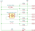

# Example: Switch Debouncing

License: MIT (see doc/LICENSE)

This code shows how to configure RTC IO and ULP to debounce switches.
A rotatary AB decoder is included as well

## RTC IO circuit and connections
The circuit does not rely on ESP32 internal pull-up or pull-down. The circuit allows for wake-up from deep sleep so pull-down resistors and switches connected to +3.3V must be used.
The double pole reed switch is used to improve and speed up debouncing.

|Name|RTC_IO num|RTC_IO mask|GPIO num|
|:-|:-|:-|:-|
|Reed contact NO|RTC_GPIO08|0x0100|GPIO33|
|Reed contact NC|RTC_GPIO09|0x0200|GPIO32|
|Rotary A|RTC_GPIO03|0x0008|GPIO39|
|Rotary B|RTC_GPIO04|0x0010|GPIO34|
|Rotary push|RTC_GPIO05|0x0020|GPIO35|
|Push 1|RTC_GPIO00|0x0001|GPIO36|
|LED|RTC_GPIO10|0x0400|GPIO4|

GPIO 34-39 are input only and do not feature pull-up / pull-down.
Internal pull-up / pull-down are not used to conserve power during
hibernation.

## Switch Bouncing

The figure below shows aflow chart for switch debouncing. It does not include the decoding of the rotary encoder.

ULP register usage

|Name|Description|
|:-|:-|
|r0|temporary|
|r1|current value|
|r2|previous value|
|r3|memory address|

The flow starts after wakeup from hibernation. This happens when
an IO changes to high. Begore this it must be low. The ULP loops forever
and checks if any IO changed. If this is the case the IO is rechecked after
a wait time.

## AB Rotary Encoder Decoding

AB decoders have 4 states 1 to 4. Invalid state transitions have to be ignored

Use a table with 16 entries to determine from AB current and AB previous which
transition occured. The table contains 0 for invalid transitions, -1 if the
transition indicates counter clockwise rotation and +1 for transistions indicating
clockwise rotatation.
